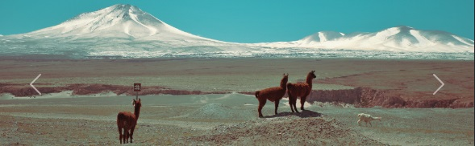
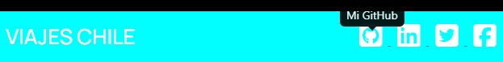

# ViajesChile
Desafio Viajes Chile

Git pages: https://jorgerodriguezoliva.github.io/Desafio-Viajes-Chile/

La agencia Viajes Chile solicita la creación de su landing page, que tenga un diseño atractivo
e innovador, utilizando los conocimientos que has adquirido a través de las distintas
unidades.

Para este desafio se creo utilizando los siguientes complementos a nuestro HTML:

-Bootstrap
-Fontawesome
-Google Font
-Jquery

La estructura:

-navbar "Barra de navegación transparente que cambia de color con el scroll y lleva a cada sección de la página".

-header con un carrusel de 3 imagenes locales que ruedan constantemente.

-section de ¿Quiénes somos? con iconos que desaparacen en formato móvil.

-section de 4 tarjetas que ocultan texto con click en imagen y tansición.

-secton de contacto con funcion alert en boton de enviar.

-footer con con redirección al inicio sobre texto y tooltip sobre redes sociales.
